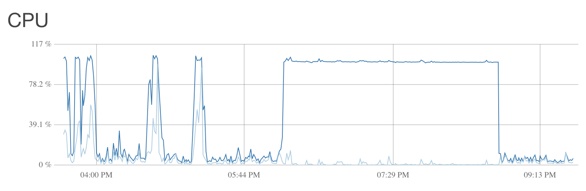

IPv6, CryptCheck, Mozilla Observatory, & Nginx
========

[instances.mastodon.xyz](https://instances.mastodon.xyz) uses a combination of uptime, [CryptCheck](https://tls.imirhil.fr), [Observatory by Mozilla](https://observatory.mozilla.org), and IPv6 compatibility to give your instance a rating. This document will help you secure your site to the current best standards based on these rating sites.

## IPv6

This guide will assume that you enabled an IPv6 address when created your droplet. If you didn't you can follow [DigitalOcean's guide](https://www.digitalocean.com/community/tutorials/how-to-enable-ipv6-for-digitalocean-droplets) on how to enable it.

### DNS

I prefer to keep my name servers with my domain registrar, so I created an `NS record` that points `mastodon` (mastodon.michaeljdeeb.com) to `ns1.digitalocean.com`, `ns2.digitalocean.com`, and `ns3.digitalocean.com`.

Assuming you already have IPv4 set up, all you need to do is add an `AAAA Record` that directs to the IPv6 address of your droplet.

In my specific example, I then logged into DigitalOcean, clicked the Networking tab, and added my sub-domain. I created an `A record` with the hostname `@` (because the domain I gave DigitalOcean is mastodon.michaeljdeeb.com) that points to my IPv4 address and an `AAAA record` again with the hostname `@` that points to the IPv6 address.

### Troubleshooting

As always, a lot can go wrong configuring this stuff and it can take awhile to propagate.

- If you are trying to connect to the Droplet via its IPv6 address, make sure the network you're on has IPv6 support. You can use [Google's tool](http://ipv6test.google.com) to check.
- Make sure nginx is listening for IPv6 traffic. You can check with `netstat -tulpan | grep nginx` you should see the following in a longer list. The first one is IPv4, the second is IPv6.
```
tcp        0      0 0.0.0.0:80              0.0.0.0:*               LISTEN      1102/nginx.conf
tcp6       0      0 :::80                   :::*                    LISTEN      1102/nginx.conf
```

## Securing Nginx

I was able to score a B for both Observatory and CryptCheck following a guide. I will link the guide at the end of this section, but you will have to make the changes below to score above a B.

### Let'sEncrypt

When it comes time to generate the certificate, you will need an additional flag.
```
sudo letsencrypt certonly -a webroot --webroot-path=/var/www/html -d example.com -d www.example.com --rsa-key-size 4096
```

### Generate Strong Diffie-Hellman Group

Again, we need a 4096-bit group, so instead of what they have we'll use
```
sudo openssl dhparam -out /etc/ssl/certs/dhparam.pem 4096
```



On a $5 DigitalOcean box, generating this took **3 hours**. I also had a 1G swap, I'm not sure if that is needed or not. (My single-user Mastodon was fine while this was happening).

### Nginx Configuration Files

There are a lot of these (more of them will be discussed in the next section) and I'm not 100% sure which one was the right one to change.

#### /etc/nginx/snippets/ssl-params.conf
`ssl_protocols TLSv1 TLSv1.1 TLSv1.2;` -> `ssl_protocols TLSv1.2;`
`ssl_ciphers "EECDH+AESGCM:EDH+AESGCM:AES256+EECDH:AES256+EDH";` -> `ssl_ciphers "AES256+EECDH:AES256+EDH";`

### The Guide
[How To Secure Nginx with Let's Encrypt on Ubuntu 16.04](https://www.digitalocean.com/community/tutorials/how-to-secure-nginx-with-let-s-encrypt-on-ubuntu-16-04) will guide you through the real process. Just refer back to this document when you get to a part where security needs to be stronger than the guide recommends.

## Mastodon Nginx Configuration File
Copy the contents of the [Production Guide](https://github.com/tootsuite/documentation/blob/master/Running-Mastodon/Production-guide.md#nginx) into `/etc/nginx/sites-enabled/mastodon_nginx.conf` changing `server_name`, `ssl_certificate`, `ssl_certificate_key`, `root`, to values relevant to your server.

Then change the following:
- `ssl_ciphers EECDH+AESGCM:EECDH+AES;` -> `ssl_ciphers "AES256+EECDH:AES256+EDH";`
- add `add_header Content-Security-Policy "default-src 'none'; style-src 'self'; script-src 'self'; img-src 'self' data:; connect-src 'self' wss://mastodon.michaeljdeeb.com; font-src 'self'; frame-ancestors 'none'; media-src 'self'";` above `add_header Strict-Transport-Security "max-age=31536000";` **and change the wss:// URL**

The Content-Security-Policy is the only reason I was getting a B from Observatory, simply because I didn't have one. I found [this thred](https://mastodon.al/users/Spike/updates/27) and used [this reply](https://social.papill0n.org/users/lu/updates/6) to get to that CSP header. It is currently giving me errors, but isn't majorly breaking anything. You may need to tweak it to suit your server better.

## Nginx.conf

This section may not be needed, but within /etc/nginx/nginx.conf I made the following change:
- `ssl_protocols TLSv1 TLSv1.1 TLSv1.2;` -> `ssl_protocols TLSv1.2;`

## Done

Restart nginx using `sudo systemctl restart nginx` and you should score an A+ from Observatory by Mozilla and CryptCheck. Observatory is really good about explaining what's needed to improve your score, but CryptCheck is erm... _cryptic_ (heh). You can find an explanation of your score on the [GitHub repo of the tool](https://github.com/aeris/cryptcheck#understanding-results). Specifically in the score section read carefully on what needs to change to improve your score.

I'm not 100% clear on the hierarchy of all of the nginx configuration files. You may be able to add some of the above stuff to the "top" nginx.conf file and then not have to worry about managing it downstream, but I haven't tested this theory.
